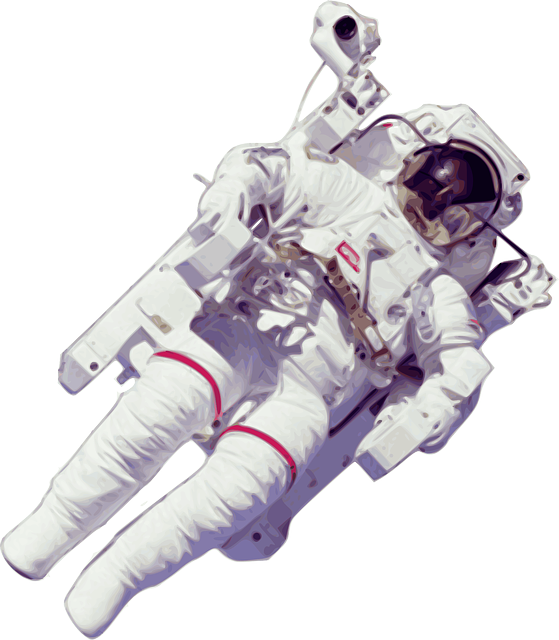

# absolutely-positioned-images
Use absolute bottom positioning with your images so that they are fixed and appear to peek over a designated break line.

## Tutorial
For detailed instruction's, view Solodev's [How to Use Absolute Positioning with Your Images](https://www.solodev.com/blog/how-to-use-absolute-positioning-with-your-images.stml) article.

## Demo
  		  
Try out a working example on [JSFiddle](https://jsfiddle.net/solodev/54agr8kp/1/).

## HTML

The tutorial contains the following basic HTML markup.

```
<section>
	<div class="container position-relative py-lg-6 py-5">
		<div class="row">
			<h2 class="display-4 mb-0 text-white">Be part of the <span class="d-block font-weight-bold">Lunar XPerience</span></h2>
			<p class="lead my-4 text-white">If you're an explorer, then the moon is calling.
				<br>Join the LunarXP mission where new worlds await.</p>
			<div class="spacer"></div>
		</div>
		<div class="position-absolute left-0 w-100 text-center d-md-block image-container">
			
		</div>
	</div>
</section>
```

## CSS
All required CSS is contained with style.css

## External Resources
This tutorial includes the following third party resources.

```
<link rel="stylesheet" href="https://stackpath.bootstrapcdn.com/bootstrap/4.1.3/css/bootstrap.min.css">
<script src="https://code.jquery.com/jquery-3.3.1.slim.min.js"></script>
<script src="https://stackpath.bootstrapcdn.com/bootstrap/4.1.3/js/bootstrap.min.js"></script>
```
